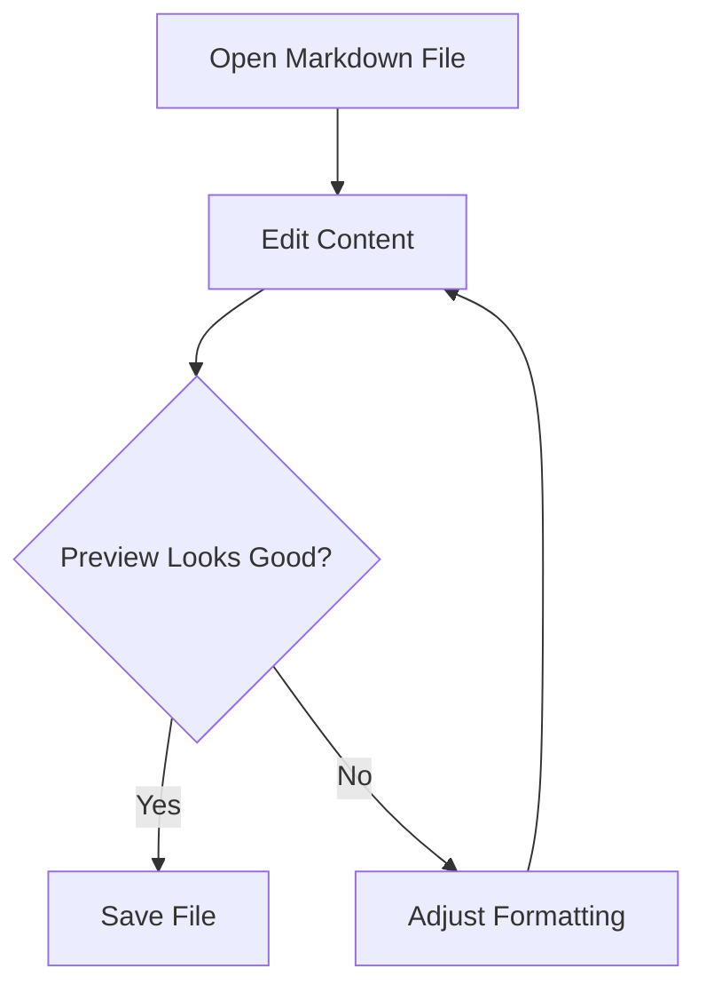

# Markdown Playground

This file uses **dummy content** to showcase a wide range of Markdown elements.
Use it to test rendering, editing, copy/paste behavior, tables, diagrams, and formatting fidelity.

---

## Table of Contents

1. [Text Styling](#text-styling)
2. [Headings](#headings)
3. [Lists](#lists)
4. [Quotes](#quotes)
5. [Links and Images](#links-and-images)
6. [Tables](#tables)
7. [Code](#code)
8. [Math](#math)
9. [Mermaid Diagram](#mermaid-diagram)
10. [Mixed Content](#mixed-content)

## Text Styling

Plain paragraph text with dummy product copy for **Project Aurora**, a fictional analytics dashboard.

- **Bold text**
- *Italic text*
- ***Bold and italic text***
- ~~Strikethrough text~~
- `inline_code(example)`

You can also combine styles like **bold with `inline code` inside** and *italic text with a [link](https://example.com)*.

Escaped characters: \*not italic\*, \#not a heading, \[not a link\].

A forced line break appears here.  
This line starts immediately below the previous one.

## Headings

# Heading 1 - Aurora Overview
## Heading 2 - Team Snapshot
### Heading 3 - Sprint Summary
#### Heading 4 - Module Details
##### Heading 5 - Edge Notes
###### Heading 6 - Tiny Label

## Lists

### Unordered List

- Dashboard
- Reports
- Alerts
  - Email alerts
  - Slack alerts
  - Webhook alerts
- Settings

### Ordered List

1. Create a workspace
2. Import sample data
3. Configure filters
4. Export the weekly report

### Task List

- [x] Seed demo records
- [x] Generate placeholder charts
- [ ] Review mobile spacing
- [ ] Finalize launch copy

## Quotes

> "Aurora turns noisy metrics into readable stories."
>
> — Dummy Product Team

> Nested quote example:
>> Level two quote with `inline code`
>>> Level three quote for stress testing block depth

## Links and Images

- External link: [Example Domain](https://example.com)
- Mail link: [demo@example.com](mailto:demo@example.com)
- Section link: [Jump to Tables](#tables)

Image using a local asset from this repo:


## Tables

### Basic Table

| Feature | Status | Owner |
| ------- | ------ | ----- |
| Editor sync | Ready | Alex |
| Theme switcher | In review | Sam |
| Search panel | Planned | Jordan |

### Alignment Table

| Left Align | Center Align | Right Align |
| :--------- | :----------: | ----------: |
| alpha | beta | 120 |
| gamma | delta | 480 |
| omega | sigma | 960 |

## Code

### Fenced Code Block - TypeScript

```ts
type Widget = {
  id: string;
  label: string;
  active: boolean;
};

const sampleWidget: Widget = {
  id: 'widget-001',
  label: 'Revenue Overview',
  active: true,
};

console.log(sampleWidget);
```

### Fenced Code Block - JSON

```json
{
  "workspace": "aurora-demo",
  "users": 42,
  "enabled": true,
  "tags": ["sample", "staging", "dummy"]
}
```

### Fenced Code Block - Bash

```bash
npm install
npm run build
code test.md
```

### Indented Code Block

    SELECT id, name, status
    FROM demo_tasks
    WHERE archived = false
    ORDER BY updated_at DESC;

## Math

Inline math: $E = mc^2$

Block math:

$$
\text{score} = \frac{\text{completed tasks}}{\text{total tasks}} \times 100
$$

Another example:

$$
\sum_{i=1}^{5} i = 15
$$

## Mermaid Diagram



## Mixed Content

### Sample Release Note

**Version:** `v0.0.0-demo`  
**Environment:** Staging  
**Last updated by:** Dummy User

Aurora shipped a fictional release containing:

1. Faster chart loading
2. Cleaner table rendering
3. Improved checklist interactions

> Note: All names, values, and scenarios in this file are placeholders.

---

### Mini Checklist Table

| Item | Type | Done |
| ---- | ---- | ---- |
| Hero copy | Content | Yes |
| Pricing card | UI | No |
| API smoke test | QA | Yes |

### Quick Reference

- Shortcut example: press `Ctrl+Shift+P`
- Filename example: `reports/weekly-summary.md`
- URL example: <https://example.org/docs/demo>

End of dummy sample.
